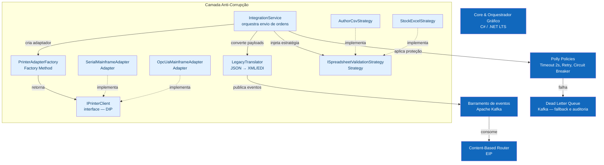

# C4 — Nível 3: Componentes do Core & Integração (ACL)

```mermaid
flowchart TB
    CORE["Core & Orquestrador Gráfico<br/>C# / .NET LTS"]
    KAFKA["Barramento de eventos<br/>Apache Kafka"]

    subgraph ACL["Camada Anti-Corrupção"]
        SERVICE["IntegrationService<br/>orquestra envio de ordens"]
        FACTORY["PrinterAdapterFactory<br/>Factory Method"]
        CLIENT["IPrinterClient<br/>interface — DIP"]
        SERIAL["SerialMainframeAdapter<br/>Adapter"]
        OPCUA["OpcUaMainframeAdapter<br/>Adapter"]
        TRANSLATOR["LegacyTranslator<br/>JSON → XML/EDI"]
        STRATEGY["ISpreadsheetValidationStrategy<br/>Strategy"]
        CSV["AuthorCsvStrategy"]
        XLSX["StockExcelStrategy"]
    end

    RESILIENCE["Polly Policies<br/>Timeout 2s, Retry, Circuit Breaker"]
    ROUTER["Content-Based Router<br/>EIP"]
    DLQ["Dead Letter Queue<br/>Kafka — fallback e auditoria"]

    SERVICE -->|"cria adaptador"| FACTORY
    FACTORY -->|"retorna"| CLIENT
    SERIAL -.->|"implementa"| CLIENT
    OPCUA -.->|"implementa"| CLIENT
    SERVICE -->|"converte payloads"| TRANSLATOR
    TRANSLATOR -->|"publica eventos"| KAFKA
    SERVICE -->|"injeta estratégia"| STRATEGY
    CSV -.->|"implementa"| STRATEGY
    XLSX -.->|"implementa"| STRATEGY
    SERVICE -->|"aplica proteção"| RESILIENCE
    RESILIENCE -->|"falha"| DLQ
    KAFKA -->|"consome"| ROUTER

    classDef acl fill:#e1f0ff,color:#0b3d66
    classDef infra fill:#1168bd,color:#ffffff
    class SERVICE,FACTORY,CLIENT,SERIAL,OPCUA,TRANSLATOR,STRATEGY,CSV,XLSX acl
    class CORE,KAFKA,RESILIENCE,ROUTER,DLQ infra
```
