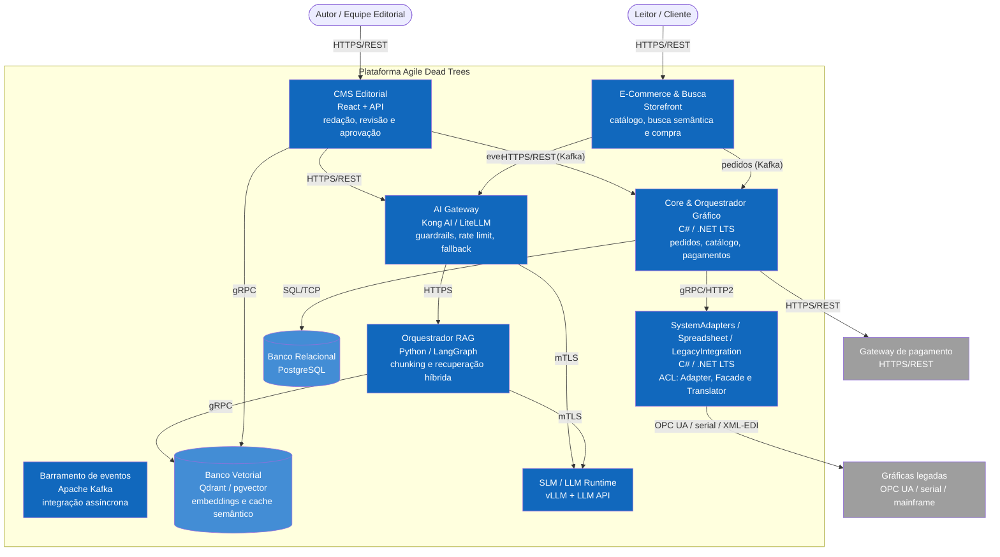

# C4 — Nível 2: Contêineres

```mermaid
flowchart TB
    Autor(["Autor / Equipe Editorial"])
    Leitor(["Leitor / Cliente"])

    subgraph ADT["Plataforma Agile Dead Trees"]
        CMS["CMS Editorial<br/>React + API<br/>redação, revisão e aprovação"]
        ECO["E-Commerce & Busca<br/>Storefront<br/>catálogo, busca semântica e compra"]
        CORE["Core & Orquestrador Gráfico<br/>C# / .NET LTS<br/>pedidos, catálogo, pagamentos"]
        KAFKA["Barramento de eventos<br/>Apache Kafka<br/>integração assíncrona"]
        AIGW["AI Gateway<br/>Kong AI / LiteLLM<br/>guardrails, rate limit, fallback"]
        RAG["Orquestrador RAG<br/>Python / LangGraph<br/>chunking e recuperação híbrida"]
        VECTOR[("Banco Vetorial<br/>Qdrant / pgvector<br/>embeddings e cache semântico")]
        LLM["SLM / LLM Runtime<br/>vLLM + LLM API"]
        DB[("Banco Relacional<br/>PostgreSQL")]
        ADAPTERS["SystemAdapters / Spreadsheet / LegacyIntegration<br/>C# / .NET LTS<br/>ACL: Adapter, Facade e Translator"]
    end

    Graficas["Gráficas legadas<br/>OPC UA / serial / mainframe"]
    Pagamento["Gateway de pagamento<br/>HTTPS/REST"]

    Autor -->|"HTTPS/REST"| CMS
    Leitor -->|"HTTPS/REST"| ECO
    CMS -->|"eventos editoriais (Kafka)"| CORE
    ECO -->|"pedidos (Kafka)"| CORE
    CORE -->|"SQL/TCP"| DB
    CORE -->|"gRPC/HTTP2"| ADAPTERS
    ADAPTERS -->|"OPC UA / serial / XML-EDI"| Graficas
    CORE -->|"HTTPS/REST"| Pagamento
    CMS -->|"HTTPS/REST"| AIGW
    ECO -->|"HTTPS/REST"| AIGW
    AIGW -->|"HTTPS"| RAG
    AIGW -->|"mTLS"| LLM
    RAG -->|"gRPC"| VECTOR
    RAG -->|"mTLS"| LLM
    CMS -->|"gRPC"| VECTOR

    classDef container fill:#1168bd,color:#ffffff
    classDef data fill:#438dd5,color:#ffffff
    classDef external fill:#9e9e9e,color:#ffffff
    class CMS,ECO,CORE,KAFKA,AIGW,RAG,LLM,ADAPTERS container
    class VECTOR,DB data
    class Graficas,Pagamento external
```
