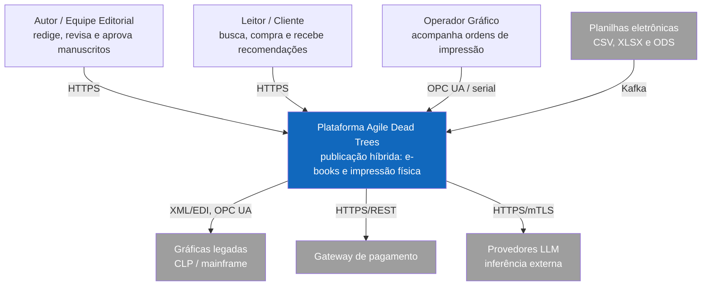

# C4 — Nível 1: Contexto

```mermaid
flowchart TB
    Autor["Autor / Equipe Editorial<br/>redige, revisa e aprova manuscritos"]
    Leitor["Leitor / Cliente<br/>busca, compra e recebe recomendações"]
    Operador["Operador Gráfico<br/>acompanha ordens de impressão"]

    ADT["Plataforma Agile Dead Trees<br/>publicação híbrida: e-books e impressão física"]

    Graficas["Gráficas legadas<br/>CLP / mainframe"]
    Pagamento["Gateway de pagamento"]
    LLM["Provedores LLM<br/>inferência externa"]
    Planilhas["Planilhas eletrônicas<br/>CSV, XLSX e ODS"]

    Autor -->|"HTTPS"| ADT
    Leitor -->|"HTTPS"| ADT
    Operador -->|"OPC UA / serial"| ADT
    ADT -->|"XML/EDI, OPC UA"| Graficas
    ADT -->|"HTTPS/REST"| Pagamento
    ADT -->|"HTTPS/mTLS"| LLM
    Planilhas -->|"Kafka"| ADT

    classDef core fill:#1168bd,color:#ffffff
    classDef external fill:#9e9e9e,color:#ffffff
    class ADT core
    class Graficas,Pagamento,LLM,Planilhas external
```
